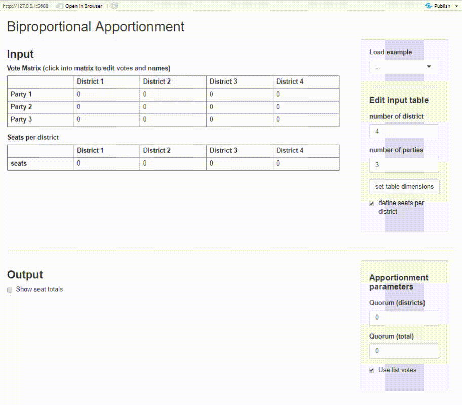

# proporz 

Calculate seat apportionments for legislative bodies with various methods. 
Methods inlcude divisor methods (e.g. D'Hondt, Webster or Adams), quota methods
(e.g. largest remainder method) and biproportional apportionment.

_Mit diesem R-Package können mittels verschiedener Sitzzuteilungsverfahren 
Wählerstimmen in Abgeordnetensitze umgerechnet werden. Das Package beinhaltet 
Quoten-, Divisor- und biproportionale Verfahren ("Doppelter Pukelsheim")._

- [Install](#install)
- [Apportionment methods overview](#apportionment-methods-overview)
- [Divisor and quota method examples](#divisor-and-quota-examples)
- [Biproportional apportionment examples](#biproportional-apportionment-examples)
- [Shiny app](#shiny-app)
- [See also](#see-also)

<br/>

## Install
Install the package from Github:

```r
# install.packages("devtools")
devtools::install_github("polettif/proporz")
```
<br/>

## Apportionment methods overview

### Divisor methods
| divisor method | known as... | function |
| :---|:---|:---|
| [Floor](https://en.wikipedia.org/wiki/D%27Hondt_method) | D'Hondt, Jefferson, Hagenbach-Bischoff | [divisor_floor(votes, n_seats, quorum = 0)](https://polettif.github.io/proporz/reference/divisor_floor.html)
| [Round](https://en.wikipedia.org/wiki/Webster/Sainte-Lagu%C3%AB_method) | Sainte-Laguë, Webster | [divisor_round(votes, n_seats, quorum = 0)](https://polettif.github.io/proporz/reference/divisor_round.html)
| [Ceiling](https://de.wikipedia.org/wiki/Adams-Verfahren) | Adams | [divisor_ceiling(votes, n_seats, quorum = 0](https://polettif.github.io/proporz/reference/divisor_ceiling.html)
| [Harmonic rounding](https://de.wikipedia.org/wiki/Dean-Verfahren) | Dean | [divisor_harmonic(votes, n_seats, quorum = 0)](https://polettif.github.io/proporz/reference/divisor_harmonic.html)
| [Geometric rounding](https://en.wikipedia.org/wiki/Huntington%E2%80%93Hill_method) | Huntington-Hill | [divisor_geometric(votes, n_seats, quorum = 0)](https://polettif.github.io/proporz/reference/divisor_geometric.html)

### Quota methods
| quota method | known as... | function |
| :---|:---|:---|
| [Largest remainder](https://en.wikipedia.org/wiki/Largest_remainder_method) | Hamilton, Hare-Niemeyer, Vinton | [quota_largest_remainder(votes, n_seats, quorum = 0)](https://polettif.github.io/proporz/reference/quota_largest_remainder.html)

### Biproportional methods
| biproportional method | known as... | function |
| :---|:---|:---
| [Generic Biproportional apportionment](https://en.wikipedia.org/wiki/Biproportional_apportionment) | - | [biproporz(...)](https://polettif.github.io/proporz/reference/biproporz.html)
| [Doppeltproportionales Zuteilungsverfahren](https://de.wikipedia.org/wiki/Doppeltproportionales_Zuteilungsverfahren) | Doppeltproportionale Divisormethode mit Standardrundung, Doppelproporz, "Doppelter Pukelsheim" | [pukelsheim(...)](https://polettif.github.io/proporz/reference/pukelsheim.html)

##### [Full function reference](https://polettif.github.io/proporz/reference/index.html)

<br/>

## Divisor and Quota examples
``` r
votes = c("Party A" = 690, "Party B" = 400, "Party C" = 250, "Party D" = 120)

divisor_round(votes, 10)
#> Party A Party B Party C Party D 
#>       4       3       2       1

divisor_floor(votes, 10)
#> Party A Party B Party C Party D 
#>       5       3       2       0

quota_largest_remainder(votes, 10)
#> Party A Party B Party C Party D 
#>       5       3       1       1
```

All methods are also accessible by their names with `proporz()`:
``` r
votes = c("Party A" = 651, "Party B" = 349, "Party C" = 50)

proporz(votes, 10, "sainte-lague")
#> Party A Party B Party C 
#>       7       3       0

proporz(votes, 10, "hill-huntington")
#> Party A Party B Party C 
#>       6       3       1

proporz(votes, 10, "hill-huntington", quorum = 0.05)
#> Party A Party B Party C 
#>       6       4       0
```

<br/>

## Biproportional apportionment examples

[finland-comparison.md](https://github.com/polettif/proporz/blob/master/finland-comparison.md) 
contains a simple analysis on how different election methods impact seat distributions for the 
2019 Finnish parliamentary election.

The package provides the `zug2018` data set with election data for the canton of 
Zug ([source](https://wab.zug.ch/elections/kantonsratswahl-2018/data)). 
We can use it to illustrate biproportional methods, first with `pukelsheim()`:

``` r
votes_df = unique(zug2018[c("list_id", "entity_id", "list_votes")])
district_seats_df = unique(zug2018[c("entity_id", "election_mandates")])

seats_df = pukelsheim(votes_df,
                      district_seats_df,
                      quorum_any(any_district = 0.05, total = 0.03))

head(seats_df)
#>   list_id entity_id list_votes seats
#> 1       2      1701       8108     2
#> 2       1      1701       2993     0
#> 3       3      1701      19389     3
#> 4       4      1701      14814     2
#> 5       5      1701       4486     1
#> 6       6      1701      15695     3

get_divisors(seats_df)
#> $districts
#>      1701      1702      1703      1704      1705      1706      1707      1708 
#> 5745.5376 3586.0000 2607.0000 1435.0000  743.0312 1709.0000 1816.8750 2561.0000 
#>      1709      1710      1711 
#> 2342.0000  725.5000 7275.1719 
#> 
#> $parties
#>         1         2         3         4         5         6         7 
#> 1.0000000 0.8828125 1.0000000 1.0316329 0.8750000 1.0000000 1.0537109
```

`pukelsheim` handles data.frames and is a wrapper for `biproportional` which
uses a vote matrix and district seats (vector) as input and returns a 
seat matrix.

``` r
votes_df = unique(zug2018[c("list_id", "entity_id", "list_votes")])
votes_matrix = pivot_to_matrix(votes_df)
votes_matrix
#>        entity_id
#> list_id  1701 1702 1703 1704 1705 1706 1707 1708 1709 1710  1711
#>       1  2993    0    0    0    0    0    0    0    0    0     0
#>       2  8108 4687 1584  531  279  477 2363 3860 1481   91 22023
#>       3 19389 9334 4807 1946  396 2844 3523 4702 3310  812 21343
#>       4 14814 6691 4005  826  379 1654 2842 2624 2713  461 33789
#>       5  4486 2270  621  198    0  361  728  465  925    0 10131
#>       6 15695 4705 1750   84    0   51  627 1106 1563  302 21794
#>       7 21298 8178 2875 1336  399 1450 3715 2610 4063  344 26798

distr_df = unique(zug2018[c("entity_id", "election_mandates")])
district_seats = setNames(distr_df$election_mandates, distr_df$entity_id)
district_seats
#> 1701 1702 1703 1704 1705 1706 1707 1708 1709 1710 1711 
#>   15   10    6    3    2    4    7    6    6    2   19

seats_matrix = biproporz(votes_matrix, district_seats, quorum_any(0.05, 0.03))
seats_matrix
#>         entity_id
#> list_id 1701 1702 1703 1704 1705 1706 1707 1708 1709 1710 1711
#>       1    0    0    0    0    0    0    0    0    0    0    0
#>       2    2    1    1    0    0    0    1    2    1    0    3
#>       3    3    3    2    1    1    2    2    2    1    1    3
#>       4    2    2    1    1    0    1    2    1    1    1    5
#>       5    1    1    0    0    0    0    0    0    0    0    2
#>       6    3    1    1    0    0    0    0    0    1    0    3
#>       7    4    2    1    1    1    1    2    1    2    0    3
```

<br/>

## Shiny app

The package provides a basic Shiny app where you can calculate biproportional
apportionment on an interactive dashboard. You need have the packages `shiny` 
and `shinyMatrix` installed.

```r
# install.packages("shiny")
# install.packages("shinyMatrix")
library(proporz)
run_app()
```


<br/>

## See also

- [RBazi](https://www.math.uni-augsburg.de/htdocs/emeriti/pukelsheim/bazi/RBazi.html): Package using rJava to access the functions of the [BAZI](https://www.math.uni-augsburg.de/htdocs/emeriti/pukelsheim/bazi/welcome.html).
- [seatdist](https://github.com/jmedzihorsky/seatdist) package for seat apportionment and disproportionality measurement.
- [apportR](https://github.com/jalapic/apportR): Package containing various apportionment methods, with particular relevance for the problem of apportioning seats in the House of Representatives.
- [disprr](https://github.com/pierzgal/disprr) Examine Disproportionality of Apportionment Methods.

#### Why another package?
Mainly because I wanted to implement biproportional apportionment in base R as 
an exercise. I'm aware that the other packages provide more methods or better 
analysis. However, biproportional apportionment is missing from the other 
pure R packages and RBazi needs rJava with an accompanying jar.
